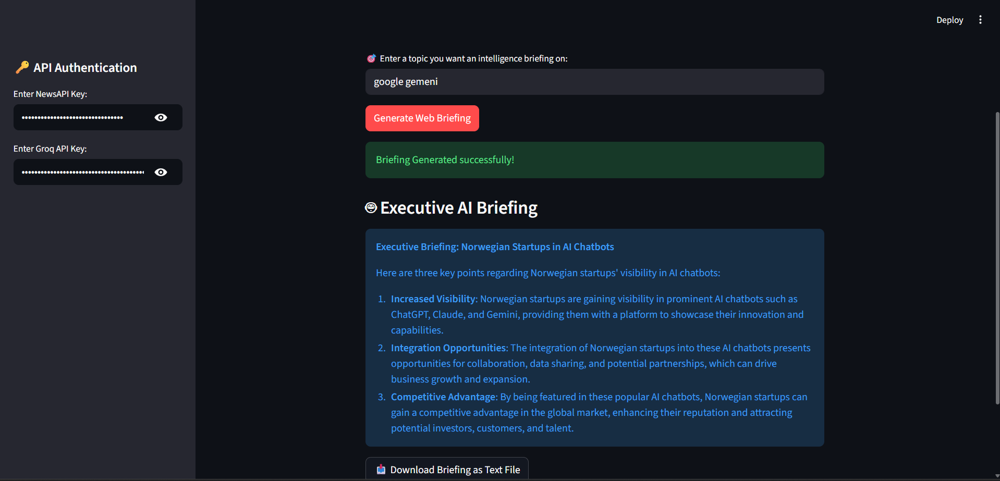

# 📰 Autonomous AI News Briefing Agent

An AI-powered news intelligence application that automatically gathers the latest news on any topic, analyzes headlines using Groq Llama 3, and generates concise executive briefings.

Built using Python, NewsAPI, Groq, and Streamlit.

## 📸 Demo



## 🚀 Features

- Fetches live news using NewsAPI
- Extracts and processes top headlines
- Generates AI-powered executive briefings
- Streamlit web interface
- Download briefing as text file

## 🛠️ Tech Stack

- Python
- Streamlit
- Groq (Llama 3)
- NewsAPI
- Requests

## ▶️ Run Locally

```bash
pip install -r requirements.txt
streamlit run app_web.py
